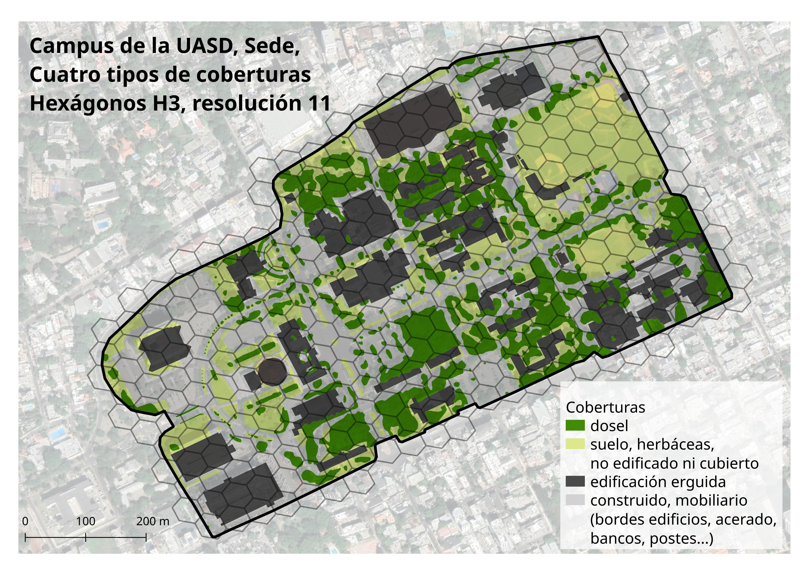

<!-- README.md se genera a partir de README.Rmd. Por favor, edita ese archivo. -->

*Por José Ramón Martínez Batlle*

[](https://zenodo.org/badge/latestdoi/692893783)

Entrada BibTeX, [aquí](#entrada-bibtex)

## Descripción

Este repositorio contiene fuentes de datos para prácticas de las asignaturas que imparto en la Universidad Autónoma de Santo Domingo.

## Contenido

Relaciono las fuentes de datos disponibles a continuación:

- Índice espacial de hexágonos H3 de [resolución 11](fuentes/h3-res-11.gpkg) y de [resolución 12](fuentes/h3-res-12-no-edificios.gpkg). Capas vectoriales conteniendo la porción intersectada del índice espacial de hexágonos H3, resoluciones 11 y 12 [@uber2023h3]. Este índice consiste en un sistema geoespacial de código abierto que utiliza celdas hexagonales para indexar el mundo, ofreciendo funciones para manipular y analizar dichas celdas.

- [Coberturas del suelo](fuentes/tipos-cob-2-epsg-32619-cleaned-3.shp). Capa vectorial de coberturas del suelo, conformada por polígonos que representan las siguientes cuatro coberturas: dosel, suelo con herbáceas o sin ellas, edificios erguida y construcciones (mobiliario, edificios, acertado, etc.). Los polígonos fueron digitalizados manualmente usando QGIS [@QGIS_software] sobre una imagen satelital óptica de 2016, cuya resolución es de 60 cm/px, accedida a través de cuadros WMS de Google Maps [@googlemaps].

- [Polígono de perímetro](fuentes/poligono-uasd.gpkg). Capa vectorial conteniendo el polígono núcleo del campus de la Universidad Autónoma de Santo Domingo (UASD) en su sede central.

- [Hexágonos clasificados según cobertura](fuentes/h3-res-12-no-edificios-clasificado.gpkg). Este archivo contiene los hexágonos clasificados según su cobertura predominante. Fue realizado usando el *script* [**clasificacion-de-hexagonos.md**](clasificacion-de-hexagonos.md)


**Figura 1**. Mapa síntesis del polígono núcleo del campus de la Universidad Autónoma de Santo Domingo (UASD) en su sede central. Superpuestos, y mezclados con imagen satélital de alta resolución (Google; Airbus, CNES; Airbus, Landsat; Copernicus; Maxar Technologies; U.S. Geological Survey, 2023), se incluye también una capa de coberturas del suelo y el arreglo de hexágonos H3 de resolución 11 intersectados en el campus.


## Entrada BibTex

```
@software{jose_ramon_martinez_batlle_2023_8353988,
  author       = {José Ramón Martínez Batlle},
  title        = {{geofis/coberturas-suelo-uasd: Coberturas del suelo 
                   del polígono núcleo del campus de la Universidad
                   Autónoma de Santo Domingo (UASD) en su sede
                   central}},
  month        = sep,
  year         = 2023,
  publisher    = {Zenodo},
  version      = {v0.9},
  doi          = {10.5281/zenodo.8353988},
  url          = {https://doi.org/10.5281/zenodo.8353988}
}
```


## Referencias